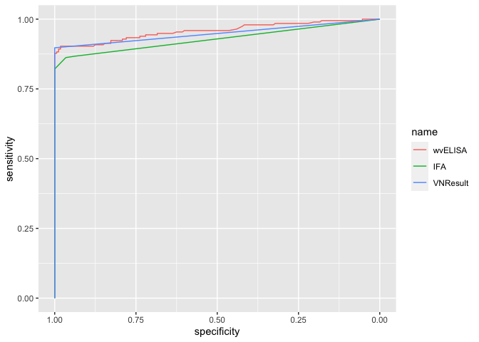

## 1.Explore the data using pROC package

### 1.1 read in data

### 1.2 calculate roc and visualization for all three assays

``` r
## ROC curves for wvELISA, IFA and SVN
rocall<-roc(Exposed~wvELISA+IFA+VNResult,data=dfroc)
plot1<-ggroc(rocall)
plot1
```



### 1.3 calculate AUC seperately using pROC package

    #> 
    #> 
    #> Table: 95% CI of AUC 
    #> 
    #> |        |       AUC|    Lowwer|     Upper|
    #> |:-------|---------:|---------:|---------:|
    #> |wvELISA | 0.9580145| 0.9366256| 0.9794033|
    #> |IFA     | 0.9285859| 0.9031649| 0.9540069|
    #> |SVN     | 0.9487179| 0.9273719| 0.9700640|

### 1.4 pair-wise ROC test (test difference in AUC) using pROC package

    #> 
    #>  Bootstrap test for two correlated ROC curves
    #> 
    #> data:  roc1 and roc2
    #> D = 2.7163, boot.n = 10000, boot.stratified = 1, p-value = 0.006601
    #> alternative hypothesis: true difference in AUC is not equal to 0
    #> sample estimates:
    #> AUC of roc1 AUC of roc2 
    #>   0.9580145   0.9283437
    #> 
    #>  Bootstrap test for two correlated ROC curves
    #> 
    #> data:  roc1 and roc3
    #> D = 0.9089, boot.n = 10000, boot.stratified = 1, p-value = 0.3634
    #> alternative hypothesis: true difference in AUC is not equal to 0
    #> sample estimates:
    #> AUC of roc1 AUC of roc2 
    #>   0.9577991   0.9487179
    #> 
    #>  Bootstrap test for two correlated ROC curves
    #> 
    #> data:  roc2 and roc3
    #> D = -2.0545, boot.n = 10000, boot.stratified = 1, p-value = 0.03993
    #> alternative hypothesis: true difference in AUC is not equal to 0
    #> sample estimates:
    #> AUC of roc1 AUC of roc2 
    #>   0.9282197   0.9487179

wv_ELISA vs IFA, significant D = 2.7292, boot.n = 10000, boot.stratified
= 1, p-value = 0.006349

wv_ELISA vs SVN D = 0.91109, boot.n = 10000, boot.stratified = 1,
p-value = 0.3622

IFA vs SVN D = -2.0285, boot.n = 10000, boot.stratified = 1, p-value =
0.04251

## 2.Explore the data while considering the repeated measures data structure

### 2.1 calculate AUC seperatly using bootstrap methods (boot and pROC packages)

    #>         wvELISA       IFA       SVN
    #> AUC   0.9580586 0.9288856 0.9485294
    #> Lower 0.9352018 0.8980231 0.9252513
    #> Upper 0.9764221 0.9537447 0.9695431

#### 2.2. pair-wise test (test difference in AUC) using boot and pROC packages

    #>        2.5%       97.5% 
    #> 0.004511347 0.057554813
    #>        2.5%       97.5% 
    #> -0.01079228  0.03098910
    #>         2.5%        97.5% 
    #> -0.043256609  0.001338373
    #>   ELISA_IFA_pvalue ELISA_SVN_pvalue IFA_SVN_pvalue
    #> 1        0.0335318         0.379269     0.06916851
